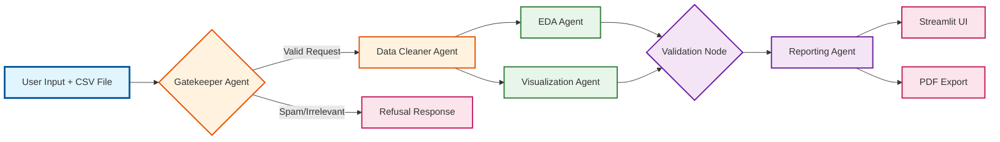

# Intelligent Data Analyst Agent


## Overview

**Intelligent Data Analyst Agent** is an enterprise-grade AI system designed to automate the end-to-end data analysis workflow. Unlike simple chatbots, this system employs a **Multi-Agent Architecture** orchestrated by **LangGraph**.

It simulates a real-world Data Team, where specialized agents (Cleaner, Analyst, Visualizer, Manager) collaborate to transform raw CSV data into professional, actionable business reports with visualizations.

### Key Differentiators
* **Dynamic Context Awareness:** The system adapts its analysis strategy based on data domain (e.g., Sales vs. Healthcare vs. Education) automatically.
* **Parallel Execution:** EDA and Visualization agents run concurrently for optimal performance.
* **Self-Correction & Robustness:** Agents act aggressively to clean "dirty" data and have fail-safe mechanisms for code execution.

---

## System Architecture

The system follows a directed cyclic graph (DAG) workflow with conditional routing and parallel processing.



### Agent Roles

1.  **Gatekeeper (Query Rewriter):** Validates user intent, blocks irrelevant queries to save tokens, and refines technical requirements.
2.  **Data Cleaner:** Uses Python to aggressively clean data (type casting, handling missing values, removing duplicates) and creates a `cleaned_data.csv` artifact.
3.  **EDA Agent:** Scans the cleaned data to auto-detect the "Topic", "Primary Target" (Numeric), and "Primary Group" (Categorical). It passes this context to other agents to avoid assumption bias.
4.  **Viz Agent:** Automatically selects the best chart type (Line, Bar, Histogram, Scatter) based on data characteristics and generates high-quality PNG images using `matplotlib`/`seaborn`.
5.  **Reporting Agent:** Synthesizes insights from EDA and Visualizations into a structured business report (Overview -\> Detail -\> Strategy), adapting the tone to the data domain.

-----

## Features

  * **Guardrails & Safety:** Prevents processing of non-data related queries.
  * **Python Sandbox Execution:** Agents write and execute Python code in a safe environment to perform accurate calculations (no math hallucinations).
  * **Smart Visualization:**
      * *Trend Analysis:* Auto-detects Date columns and aggregates data by Month/Week.
      * *Ranking:* Automatically limits Bar Charts to Top 10 to avoid clutter.
      * *Fail-Safe:* Fallback mechanisms if specific chart types fail.
  * **Professional Reporting:**
      * Generates multi-section reports with embedded images.
      * **PDF Export** with full Unicode (Vietnamese) support.
  * **Session History:** Sidebar navigation to review past analysis sessions.

-----

## Project Structure

```bash
intelligent-data-analyst/
├── .env                    # API Keys 
├── .gitignore              # Git ignore rules
├── requirements.txt        # Python dependencies
├── README.md               # Project documentation
├── app.py                  # Main Streamlit Application (UI Logic)
├── DejaVuSans.ttf          # Font for PDF Unicode support
└── src/
    ├── __init__.py
    ├── state.py            # Graph State definition (Shared Memory)
    ├── graph.py            # LangGraph Workflow definition
    ├── tools/
    │   └── base.py         # Python REPL Tool & Code Extractor
    └── agents/
        ├── prep.py         # Gatekeeper & Cleaner Agents
        ├── analysis.py     # EDA & Visualization Agents
        └── reporting.py    # Validation & Reporting Agents
```

-----

## Installation & Setup

### Prerequisites
  * Python 3.10 or higher
  * OpenAI API Key

### Steps

1.  **Clone the repository**

    ```bash
    git clone https://github.com/nggiabao19/intelligent-data-analyst-agent.git
    cd intelligent-data-analyst
    ```

2.  **Create and Activate Virtual Environment**

    ```bash
    python3 -m venv venv
    source venv/bin/activate  # On Windows: venv\Scripts\activate
    ```

3.  **Install Dependencies**

    ```bash
    pip install -r requirements.txt
    ```

4.  **Configure Environment**
    Create a `.env` file in the root directory:

    ```env
    OPENAI_API_KEY=sk-proj-xxxxxxxxxxxxxxxxxxxxxxxxxxxxxxxx
    ```

5.  **Run the Application**
    ```bash
    streamlit run app.py
    ```

-----


## Future Improvements
  * Add support for Local LLMs (Llama 3, Mistral) via Ollama.
  * Integrate "Human-in-the-loop" to allow users to modify the analysis plan before execution.
  * Support more data formats (Excel, JSON, SQL Databases).

## Author
*Nguyen Gia Bao*

